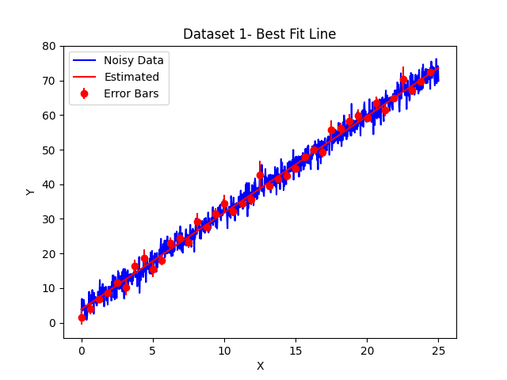
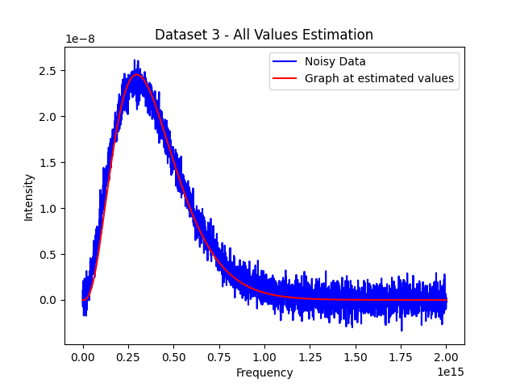

# Assignment 3 - Curve Fitting

## Dataset 1

Over here, we are given a straight line with noise added to it, and we are required to find the line that would best fit the noisy data. We find the same using the `lstsq` function from the `numpy.linalg` library. To understand how the function works, we will delve into the maths behind it.

Over here, we are given that the function that we need to find is linear, i.e. is of the form $y = f(x, p_1, p_2) = p_1 x + p_2$. We are required to find the values of $p_1$ and $p_2$. 

We are given the values that the function takes at different values of $x$. Thus, we can build the below matrix:  

$$
\mathbf{y} \equiv
\begin{pmatrix}
y_1 \\
y_2 \\
\vdots \\
y_n
\end{pmatrix}
=
\begin{pmatrix}
x_1 & 1 \\
x_2 & 1 \\
\vdots & \vdots \\
x_n & 1
\end{pmatrix}
\begin{pmatrix}
p_1 \\
p_2
\end{pmatrix}
\equiv
\mathbf{M}\mathbf{p}
$$

The function finds these parameters using the Mean Square Error as a metric (loss function), and tries to minimize the same.

{ width=75% }

## Dataset 2
- The first task here is to find the periodicity of the waves which constitute the data. This can be calculated by considering the following logic:
    - The wave consists of sin waves of frequencies which are multiples of the fundamental frequency $f$.
    - Thus, when the fundamental frequency has a value of 0, i.e. $$x = \frac{2 n\pi}{f}$$ all the other modes will also output 0, and the function will have an output of 0.
    - The other modes go to 0 more frequently, thus but analyzing the zeroes of the net function, we can comment on the fundamental frequency.
    -   This has been done by setting a tolerance of 0.3, and extracting all the values of $x$ which give a y value around this tolerance of 0.
    - A graph is constructed to visualize the placement of these points, and average of the clusters are taken, after which distance between two alternate zeroes gives the required $x$.
    - $f$ can be calculated from the same.

{ width=75% }

For the least squares function, the parameters are the amplitudes of each of the sin wave, and the constant. From the dataset, we have $y$ values for different values of $x$. Thus, the **M** matrix can be built as follows:

$$
\mathbf{y} \equiv
\begin{pmatrix}
y_1 \\
y_2 \\
\vdots \\
y_n
\end{pmatrix}
=
\begin{pmatrix}
sin(fx_1) & sin(3fx_1) & sin(5fx_1) & 1 \\
sin(fx_2) & sin(3fx_2) & sin(5fx_2) & 1 \\
\vdots & \vdots \\
sin(fx_n) & sin(3fx_n) & sin(5fx_n) & 1
\end{pmatrix}
\begin{pmatrix}
p_1 \\
p_2 \\
p_3 \\
p_4
\end{pmatrix}
\equiv
\mathbf{M}\mathbf{p}
$$

The least squares error is set up as follows:

$$
E =\sum_1^N ((p_1 sin(fx_1) + p_2 sin (3fx_2) + p_3 sin (5fx_3) + p_4) - y_i)^2
$$

- From the least squares method, we get the following graph:

{ width=75% }

- When the above frequency is given to `curve_fit` along with the comprising modes, i.e. $f, 3f$ and $5f$, it is able to very accurately guess the values of the amplitudes, even without a reasonable initial guess. (See Figure 4)

{ width=75% }

## Dataset 3
The data given in this dataset corresponds to intensity of Black Body raditiation at different frequencies, as described by the Planck formula: 

$$B(f, T) = \frac{2hf^3}{c^2} \frac{1}{e^{\frac{hf}{k_BT}-1}}$$

As expected from real life data, it has a lot of noise. 

#### First Solution
In this part of the question, we use known values of $h$, $c$, $k_b$ and feed them into the `curve_fit` function of Python's `scipy.optimize` library to find the optimal value of T.
It becomes very evident that providing an initial point is very important for a proper estimation of the temperature. Giving no initial condition causes an overflow during computation. Only after providing a large enough initial guess to prevent overflow was the program able to optimize the value of T. Above an initial guess of around 150, there is no overflow, and the function always returns a fairly constant value of around T = 3891 K. (See Figure 5)

{ width=75% }

#### Second Solution
In this part of the question, we treat all the terms $h$, $c$, $k_b$ and $T$ as variables. All of these are given to the `curve_fit` function to optimize. Obviously, due to the large number of variables, it does a very poor job of estimating. As compared to the first part of the question, it requires a much closer starting point to give a reasonable approximation. Even if the initial guesses are off from the true values by a factor of $10$, the predicted graph is quite a poor prediction. After providing appropriate guesses, we see a reasonably good graph guess. But, not all values calculated are close to real values. For example, the function estimates the value of $h$ to be 1.47395957 x 10-34, which is far off from the true value. A reason for this can also be the errors during data collection. As we see from the first solution, when we provide the true values for everything but the temperature, the fitted graph has a considerable deviation. This means that the data has large amounts of human error. When all parameters are given to be optimized, the `curve_fit` function distorts the values of the so called $constants$ so as to fit the data better. (See Figure 6)

{ width=75% }